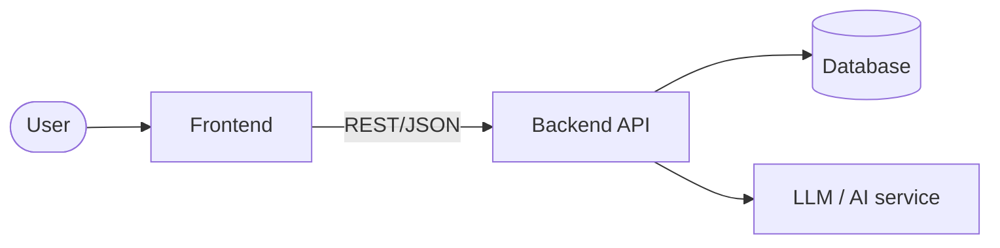

# Architecture

> The **how**, at a high level. Give AI agents the big picture so their
> implementations fit together.

## Tech stack

| Layer | Choice | Why |
|--------|--------|-----|
| Frontend | <e.g. React + Vite> | <reason> |
| Backend | <e.g. FastAPI> | <reason> |
| Database | <e.g. Postgres> | <reason> |
| AI / LLM | <e.g. provider + model> | <reason> |
| Hosting | <e.g. Azure / Vercel> | <reason> |

## System diagram



## Components

### <Component A>
- **Responsibility:** <what it owns>
- **Inputs / Outputs:** <interfaces>
- **Talks to:** <other components>

### <Component B>
- **Responsibility:** <what it owns>
- **Talks to:** <...>

## Key data flows

1. <Flow name>: <step 1> → <step 2> → <step 3>

## External services & APIs

| Service | Used for | Auth method | Notes |
|----------|----------|-------------|-------|
| <name> | <purpose> | <key/OAuth> | <rate limits, cost> |

## Folder structure (target)

```
/            <repo root>
  /frontend  <...>
  /backend   <...>
  /docs      these documents
```

## Risks & open questions

- <Technical risk or unknown to resolve early>
