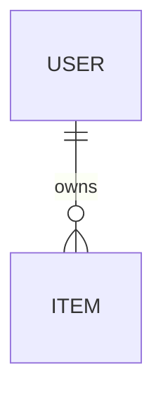

# Data Model & API Contracts

> Entities, schemas, and the API surface. Agents rely on this to avoid inventing
> incompatible interfaces. Keep it the single source of truth for shapes.

## Entities

### <Entity: e.g. User>

| Field | Type | Required | Notes |
|--------|------|----------|-------|
| id | UUID | yes | primary key |
| <field> | <type> | <yes/no> | <constraints> |

### <Entity: e.g. Item>

| Field | Type | Required | Notes |
|--------|------|----------|-------|
| id | UUID | yes | primary key |
| <field> | <type> | <yes/no> | <constraints> |

## Relationships



## API contracts

### `POST /api/<resource>`

**Request**
```json
{ "field": "value" }
```

**Response `201`**
```json
{ "id": "uuid", "field": "value" }
```

**Errors:** `400` <reason>, `401` <reason>

---

### `GET /api/<resource>/{id}`

**Response `200`**
```json
{ "id": "uuid", "field": "value" }
```

**Errors:** `404` not found

---

<Add more endpoints as needed.>

## Enums & constants

- `<EnumName>`: `<value1>` | `<value2>` | `<value3>`
