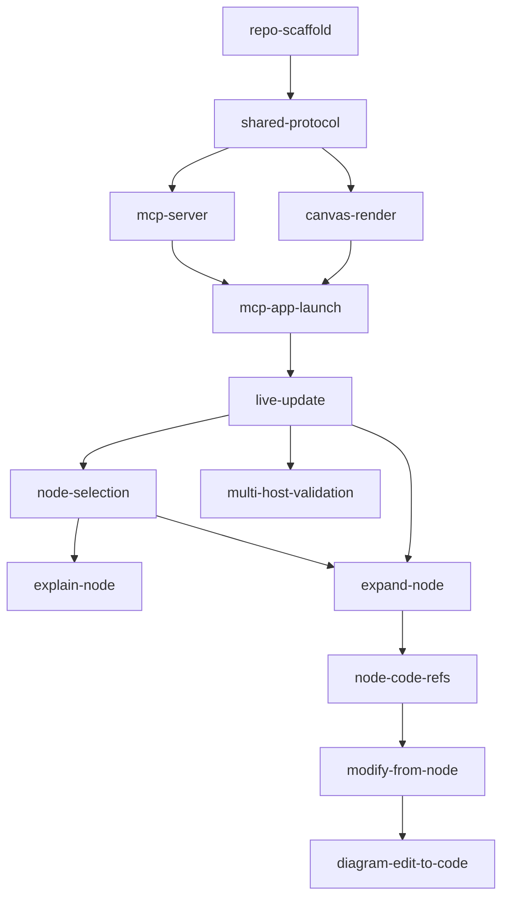

# Tasks

> The hand-off to AI agents. Small, ordered, independently-implementable items —
> one focused PR each. Reference the requirement(s) each satisfies. Claim a task by
> setting its **Status** to `in-progress` before you start (see `AGENTS.md`).

## Conventions

- **ID:** kebab-case, descriptive.
- **Status:** `todo` | `in-progress` | `in-review` | `done` | `blocked`.
- **Size:** one PR. Split if larger.

---

## Phase 0 — Scaffold

### `repo-scaffold`
- **Status:** todo · **Satisfies:** ARCHITECTURE (folder structure), NFR-3
- **Description:** Create the monorepo skeleton: `/server`, `/canvas`, `/shared`.
  Init TypeScript, package.json(s), a bundler for `/canvas` (Vite or esbuild), and
  lint/test config. Add `npm run dev`, `build`, `lint`, `test` scripts even if
  minimal.
- **Depends on:** none
- **Acceptance:** `npm install`, `npm run build`, `npm run lint`, `npm test` all
  run successfully (tests may be trivial).

### `shared-protocol`
- **Status:** todo · **Satisfies:** DATA_MODEL
- **Description:** Implement `/shared/protocol.ts` — the discriminated-union
  message types and entity interfaces (DiagramState, NodeMeta, CodeRef, Selection,
  all S→C and C→S messages) exactly as defined in `DATA_MODEL.md`. Export from
  both server and canvas.
- **Depends on:** repo-scaffold
- **Acceptance:** types compile and are importable from `/server` and `/canvas`;
  a type-level test asserts every `type` value is covered.

---

## Phase 1 — Goal 1: Visualize (Basic)

### `mcp-server`
- **Status:** todo · **Satisfies:** FR-1, FR-2, NFR-1, NFR-4
- **Description:** In `/server`, implement the **MCP server** that declares the
  canvas **MCP App** HTML UI resource (MIME `text/html;profile=mcp-app`) and
  exposes a tool to push diagrams. Wire the MCP Apps **JSON-RPC `postMessage`**
  channel so the server can send `diagram` messages to the app and receive canvas
  events back. Track session state (current diagram, selection).
- **Depends on:** shared-protocol
- **Acceptance:** the MCP host renders the app resource; a `diagram` message sent
  via the server's tool reaches the app; canvas events arrive back at the server.

### `canvas-render`
- **Status:** todo · **Satisfies:** FR-1, FR-3
- **Description:** In `/canvas`, build the MCP App that connects to the MCP Apps
  `postMessage` channel, handles `hello`, renders incoming `diagram` Mermaid as
  SVG, and provides pan/zoom (svg-pan-zoom or equivalent) with a fit/reset control.
  Show a readable error for invalid Mermaid.
- **Depends on:** shared-protocol
- **Acceptance:** given a `diagram` message, the SVG renders; pan/zoom/reset work;
  bad Mermaid shows an error, not a blank screen.

### `mcp-app-launch`
- **Status:** todo · **Satisfies:** FR-1, FR-2
- **Description:** Implement the server tool/flow that generates or accepts Mermaid
  and pushes a `diagram` message, causing the MCP host to render the canvas app in
  its iframe. Reuse the already-rendered app for subsequent diagrams.
- **Depends on:** mcp-server, canvas-render
- **Acceptance:** invoking the tool with Mermaid renders the diagram in the host's
  canvas; a second invocation updates the same surface in place.

### `live-update`
- **Status:** todo · **Satisfies:** FR-4, NFR-2, NFR-4
- **Description:** Wire live updates: new `diagram`/`patch` messages re-render the
  rendered canvas in place; handle channel reconnection/re-init gracefully.
- **Depends on:** mcp-app-launch
- **Acceptance:** pushing a second diagram updates the canvas with no manual
  refresh; the app recovers if the host re-initializes the channel.

> **Goal 1 done when:** FR-1..FR-4 pass (see `TEST_PLAN.md`).

---

## Phase 2 — Goal 2: Interact (Intermediate)

### `node-selection`
- **Status:** todo · **Satisfies:** FR-5, FR-8
- **Description:** Canvas: clicking a Mermaid node selects it (visual state) and
  emits `node_selected`. Server: persist current `(diagramId, nodeIds)`.
  Ensure stable node ids survive re-render.
- **Depends on:** live-update
- **Acceptance:** clicking highlights the node and the server can read the current
  selection; selection persists across a re-render where the node still exists.

### `explain-node`
- **Status:** todo · **Satisfies:** FR-6, FR-8
- **Description:** Implement the `explain` interaction: the canvas sends an
  `interaction` with the selection; server prompts Copilot with node context and
  surfaces the explanation in the host.
- **Depends on:** node-selection
- **Acceptance:** with a node selected, "explain this node" yields a relevant
  Copilot explanation in the host.

### `expand-node`
- **Status:** todo · **Satisfies:** FR-7
- **Description:** Implement the `expand` interaction: server regenerates a richer
  subgraph for the selected node and pushes a `diagram`/`patch`; canvas re-renders
  the expansion in place.
- **Depends on:** node-selection, live-update
- **Acceptance:** "expand this node" adds detail/subnodes for that node and the
  canvas updates in place.

---

## Phase 3 — Goal 3: Modify (Advanced)

### `node-code-refs`
- **Status:** todo · **Satisfies:** FR-9 (prerequisite)
- **Description:** Populate `NodeMeta.codeRefs` when generating diagrams so a node
  maps to concrete file/symbol locations; expose lookup in the server.
- **Depends on:** expand-node
- **Acceptance:** a selected node resolves to one or more real code locations.

### `modify-from-node`
- **Status:** todo · **Satisfies:** FR-9
- **Description:** Implement the `modify` interaction: take selected node +
  instruction, gather code context via `codeRefs`, **ask the user clarifying
  questions** in the host, apply the code change, then re-emit an updated `diagram`.
- **Depends on:** node-code-refs
- **Acceptance:** selecting an entrypoint node + "add a new entrypoint to do X"
  triggers clarifying questions, a real code edit, and an updated diagram.

### `diagram-edit-to-code` (stretch)
- **Status:** todo · **Satisfies:** FR-10
- **Description:** Allow direct diagram edits on the canvas (`diagram_edited`);
  server proposes matching code changes.
- **Depends on:** modify-from-node
- **Acceptance:** an edited node/edge produces a sensible proposed code change.

---

## Phase 4 — Stretch

### `multi-host-validation`
- **Status:** todo · **Satisfies:** NFR-3, ADR-005
- **Description:** Validate the MCP App renders and round-trips in more than one MCP
  host (e.g. Copilot CLI and the VS Code MCP client). Fix any host-specific
  rendering/CSP/channel-init issues so the same canvas bundle is portable.
- **Depends on:** live-update
- **Acceptance:** the same `diagram` push renders and accepts interactions in at
  least two MCP hosts.

---

## Dependency overview

