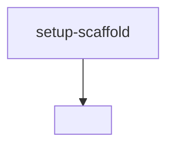

# Tasks

> The hand-off to AI agents. Decompose the work into small, ordered, independently
> implementable items. Each task should map to a single PR and reference the
> requirement(s) it satisfies.

## Conventions

- **ID:** kebab-case, descriptive (e.g. `user-auth`, not `t1`).
- **Size:** one focused PR. If it can't be done in one PR, split it.
- **Status:** `todo` | `in-progress` | `in-review` | `done` | `blocked`.

## Backlog

### `setup-scaffold`
- **Status:** todo
- **Satisfies:** ARCHITECTURE (folder structure)
- **Description:** Initialize the repo skeleton (frontend/backend/folders, package files, lint/test config).
- **Depends on:** none
- **Acceptance:** project builds and `lint`/`test` commands run (even if empty).

---

### `<task-id>`
- **Status:** todo
- **Satisfies:** <FR-x>
- **Description:** <what to implement, with enough detail to execute without re-reading the whole spec>
- **Depends on:** <task-id or none>
- **Acceptance:** <how we know it's done — point at acceptance criteria>

---

<Add more tasks. Keep them ordered by dependency.>

## Dependency overview

