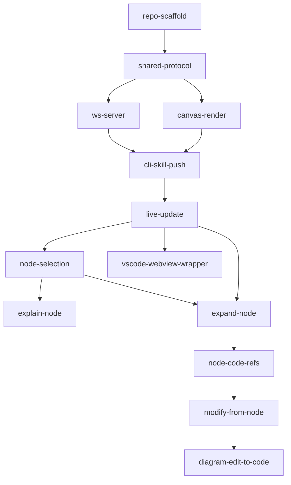

# Tasks

> The hand-off to AI agents. Small, ordered, independently-implementable items —
> one focused PR each. Reference the requirement(s) each satisfies. Claim a task by
> setting its **Status** to `in-progress` before you start (see `AGENTS.md`).

## Conventions

- **ID:** kebab-case, descriptive.
- **Status:** `todo` | `in-progress` | `in-review` | `done` | `blocked`.
- **Size:** one PR. Split if larger.

---

## Phase 0 — Scaffold

### `repo-scaffold`
- **Status:** todo · **Satisfies:** ARCHITECTURE (folder structure), NFR-3
- **Description:** Create the monorepo skeleton: `/skill`, `/canvas`, `/shared`,
  (`/extension` placeholder). Init TypeScript, package.json(s), a bundler for
  `/canvas` (Vite or esbuild), and lint/test config. Add `npm run dev`, `build`,
  `lint`, `test` scripts even if minimal.
- **Depends on:** none
- **Acceptance:** `npm install`, `npm run build`, `npm run lint`, `npm test` all
  run successfully (tests may be trivial).

### `shared-protocol`
- **Status:** todo · **Satisfies:** DATA_MODEL
- **Description:** Implement `/shared/protocol.ts` — the discriminated-union
  message types and entity interfaces (DiagramState, NodeMeta, CodeRef, Selection,
  all S→C and C→S messages) exactly as defined in `DATA_MODEL.md`. Export from
  both skill and canvas.
- **Depends on:** repo-scaffold
- **Acceptance:** types compile and are importable from `/skill` and `/canvas`;
  a type-level test asserts every `type` value is covered.

---

## Phase 1 — Goal 1: Visualize (Basic)

### `ws-server`
- **Status:** todo · **Satisfies:** FR-1, FR-2, NFR-1, NFR-4
- **Description:** In `/skill`, implement a local HTTP + WebSocket server (`ws`)
  bound to `127.0.0.1` on a free port. Serve the built `/canvas` bundle over HTTP.
  Relay protocol messages between an internal API (callable by the skill) and the
  connected canvas client. Track session state (current diagram, selection).
- **Depends on:** shared-protocol
- **Acceptance:** server starts on a free localhost port; a test WS client receives
  a `diagram` message sent via the internal API; reconnect works.

### `canvas-render`
- **Status:** todo · **Satisfies:** FR-1, FR-3
- **Description:** In `/canvas`, build the web app that connects over WebSocket,
  handles `hello`, renders incoming `diagram` Mermaid as SVG, and provides pan/zoom
  (svg-pan-zoom or equivalent) with a fit/reset control. Show a readable error for
  invalid Mermaid.
- **Depends on:** shared-protocol
- **Acceptance:** given a `diagram` message, the SVG renders; pan/zoom/reset work;
  bad Mermaid shows an error, not a blank screen.

### `cli-skill-push`
- **Status:** todo · **Satisfies:** FR-1, FR-2
- **Description:** Implement the Copilot CLI skill entry that: generates/accepts
  Mermaid, starts `ws-server` on first use, **auto-opens** the browser to the
  canvas URL, and pushes a `diagram` message. Reuse the running server on
  subsequent diagrams.
- **Depends on:** ws-server, canvas-render
- **Acceptance:** invoking the skill with Mermaid opens the browser once and shows
  the diagram; a second invocation updates the same tab.

### `live-update`
- **Status:** todo · **Satisfies:** FR-4, NFR-2, NFR-4
- **Description:** Wire live updates: new `diagram`/`patch` messages re-render the
  open canvas in place; implement client auto-reconnect with backoff.
- **Depends on:** cli-skill-push
- **Acceptance:** pushing a second diagram updates the tab with no manual refresh;
  killing/restoring the socket reconnects automatically.

> **Goal 1 done when:** FR-1..FR-4 pass (see `TEST_PLAN.md`).

---

## Phase 2 — Goal 2: Interact (Intermediate)

### `node-selection`
- **Status:** todo · **Satisfies:** FR-5, FR-8
- **Description:** Canvas: clicking a Mermaid node selects it (visual state) and
  emits `node_selected`. Server/skill: persist current `(diagramId, nodeIds)`.
  Ensure stable node ids survive re-render.
- **Depends on:** live-update
- **Acceptance:** clicking highlights the node and the skill can read the current
  selection; selection persists across a re-render where the node still exists.

### `explain-node`
- **Status:** todo · **Satisfies:** FR-6, FR-8
- **Description:** Implement the `explain` interaction: canvas/CLI sends an
  `interaction` with the selection; skill prompts Copilot with node context and
  surfaces the explanation in the CLI.
- **Depends on:** node-selection
- **Acceptance:** with a node selected, "explain this node" yields a relevant
  Copilot explanation in the terminal.

### `expand-node`
- **Status:** todo · **Satisfies:** FR-7
- **Description:** Implement the `expand` interaction: skill regenerates a richer
  subgraph for the selected node and pushes a `diagram`/`patch`; canvas re-renders
  the expansion in place.
- **Depends on:** node-selection, live-update
- **Acceptance:** "expand this node" adds detail/subnodes for that node and the
  canvas updates in place.

---

## Phase 3 — Goal 3: Modify (Advanced)

### `node-code-refs`
- **Status:** todo · **Satisfies:** FR-9 (prerequisite)
- **Description:** Populate `NodeMeta.codeRefs` when generating diagrams so a node
  maps to concrete file/symbol locations; expose lookup in the skill.
- **Depends on:** expand-node
- **Acceptance:** a selected node resolves to one or more real code locations.

### `modify-from-node`
- **Status:** todo · **Satisfies:** FR-9
- **Description:** Implement the `modify` interaction: take selected node +
  instruction, gather code context via `codeRefs`, **ask the user clarifying
  questions** in the CLI, apply the code change, then re-emit an updated `diagram`.
- **Depends on:** node-code-refs
- **Acceptance:** selecting an entrypoint node + "add a new entrypoint to do X"
  triggers clarifying questions, a real code edit, and an updated diagram.

### `diagram-edit-to-code` (stretch)
- **Status:** todo · **Satisfies:** FR-10
- **Description:** Allow direct diagram edits on the canvas (`diagram_edited`);
  skill proposes matching code changes.
- **Depends on:** modify-from-node
- **Acceptance:** an edited node/edge produces a sensible proposed code change.

---

## Phase 4 — Stretch

### `vscode-webview-wrapper`
- **Status:** todo · **Satisfies:** NFR-3, ADR-001
- **Description:** Thin VS Code extension: one command opens the `/canvas` bundle
  in a webview and bridges `postMessage` ⇄ the skill (no new logic). Use
  `asWebviewUri` + nonce for CSP.
- **Depends on:** live-update (canvas must be portable)
- **Acceptance:** running the command in VS Code shows the same canvas and a
  `diagram` push renders inside the editor.

---

## Dependency overview

